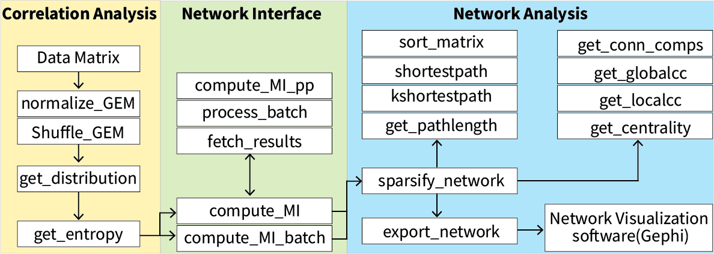

## Introduction
TITAN is a MATLAB/Octave toolbox for information theoretical analysis of molecular networks. It can be used for e.g. network analysis of gene expression data, using topological patterns to identify genes or pathways of interest. The toolbox is plug-and-play, download the code and start importing your data. For more information, see the accompanying article (Bergmans and Celikel 2021).

## Download and Setup
**MATLAB**  
[Download titan_matlab.zip](https://github.com/DepartmentofNeurophysiology/TITAN/blob/master/Releases/titan_matlab.zip?raw=true)

**Octave**  
[Download titan_octave.zip](https://github.com/DepartmentofNeurophysiology/TITAN/blob/master/Releases/titan_octave.zip?raw=true)

Or download entire repository with:
```shell
git clone https://github.com/DepartmentofNeurophysiology/TITAN.git
```

To add the toolbox files to the search path and enable all functionality, navigate in MATLAB/Octave to the TITAN directory and run the `startup` command.

## Documentation


Type `help <function>` to see detailed information about a function.

## Supporting data
### Network construction from synthetic data (Figure 3 code)
[synthetic_data.m](synthetic_data.m) contains everything necessary to recreate Figure 3 from Bergmans and Celikel. The code generates synthetic expression data from a ground truth network, constructs an MI-based network and compares it to the ground truth network. The results are shown as figures.

### Network construction from yeast expression data (Figure 5-7 data)
[yeast_data.mat](yeast_data.mat) contains the gene expression data from Ziemann et al., and the co-expression network data from YeastNet v3. See Table 1 from Bergmans and Celikel for more details on the network data.

## References
Bergmans and Celikel. 2021. “TITAN: A Toolbox for Information-Theoretic Analysis of Molecular Networks.” *(in preparation)*

Kim, Hanhae, Junha Shin, Eiru Kim, Hyojin Kim, Sohyun Hwang, Jung Eun Shim, and Insuk Lee. 2014. “YeastNet v3: A Public Database of Data-Specific and Integrated Functional Gene Networks for Saccharomyces Cerevisiae.” Nucleic Acids Research 42 (D1): D731–36. https://doi.org/10.1093/nar/gkt981.

Ziemann, Mark, Antony Kaspi, and Assam El-Osta. 2019. “Digital Expression Explorer 2: A Repository of Uniformly Processed RNA Sequencing Data.” GigaScience 8 (giz022). https://doi.org/10.1093/gigascience/giz022.
